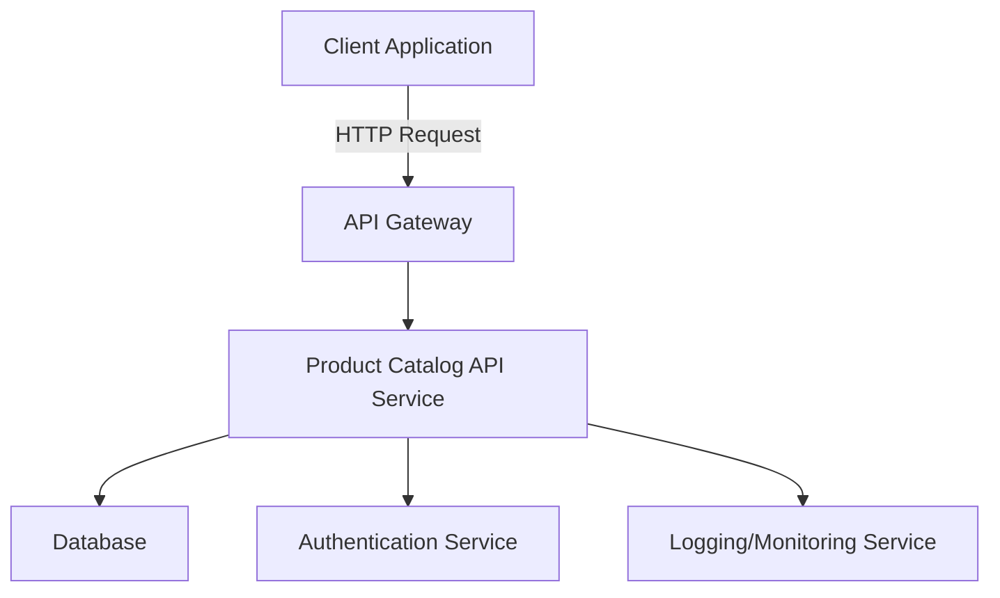
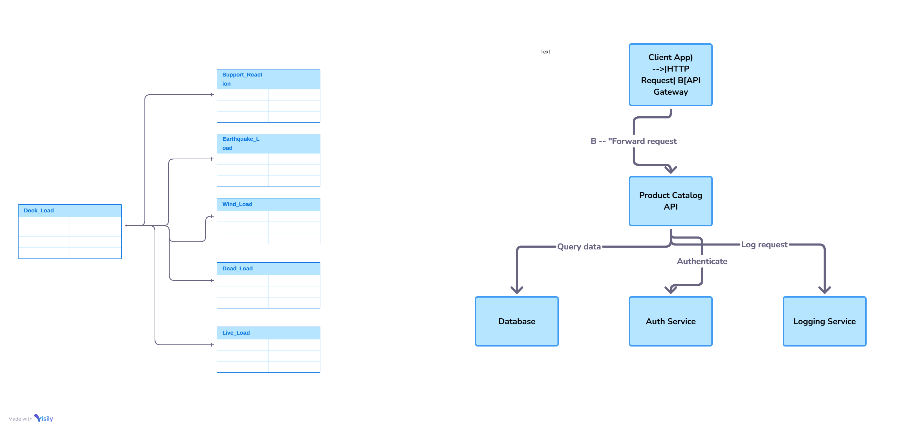

# Product Catalog API Documentation

## 1. Introduction

### Overview  
The **Product Catalog API** is a RESTful interface that allows developers and businesses to manage, access, and interact with a digital catalog of products. It provides endpoints for creating, updating, retrieving, and deleting product information, making it essential for e-commerce platforms, inventory systems, and marketplaces.

### Why It Matters  
A centralized, programmable way to manage product data is critical for scalability, automation, and maintaining data consistency across platforms. The Product Catalog API enables seamless integration between front-end interfaces (e.g., websites, mobile apps) and backend systems (e.g., inventory databases, ERP systems).

### Who This Guide is For  
This documentation is intended for:
- Backend and frontend developers integrating product data
- DevOps engineers managing deployment environments
- Technical product managers overseeing catalog systems
- QA testers validating catalog-related features

---

## 2. Key Terminology

- **API (Application Programming Interface)**: A set of rules that allows different software entities to communicate.
- **SKU (Stock Keeping Unit)**: A unique identifier for each distinct product.
- **CRUD Operations**: Create, Read, Update, Delete – core operations on persistent data.
- **Endpoint**: A specific URL where an API can be accessed.
- **JSON (JavaScript Object Notation)**: A lightweight format for storing and transporting data.
- **HTTP Methods**: Used in APIs to define the action – GET, POST, PUT, DELETE.
- **Pagination**: Dividing large data into smaller, more manageable chunks (pages).
- **Filtering**: Returning only data that meets specified criteria.

---

## 3. Technical Overview

### System Architecture

The Product Catalog API is typically deployed as a microservice within a larger application infrastructure. It connects to a database backend (e.g., PostgreSQL, MongoDB) and serves data to client applications via RESTful endpoints.




Core Frameworks & Tools
* Framework: Node.js with Express or Python Flask/Django REST Framework

* Database: PostgreSQL, MySQL, MongoDB

* Authentication: JWT (JSON Web Tokens) or OAuth 2.0

* Hosting: AWS (EC2, Lambda), Azure, or GCP

* Monitoring: Prometheus, New Relic, ELK Stack

## 4. Step-by-Step Guide or Workflow
### 4.1 Authentication
Most APIs require an API key or token for authentication.

http
```
Authorization: Bearer <your-token>

```
4.2 CRUD Operations
#### 1. Create a Product (POST)
http
Copy
Edit
POST /api/products
Content-Type: application/json
Request Body:

json
```
{
  "name": "Wireless Mouse",
  "sku": "WM123",
  "price": 29.99,
  "category": "Accessories",
  "description": "Ergonomic wireless mouse",
  "in_stock": true
}
Response:
```

json
```
{
  "id": "1a2b3c",
  "message": "Product created successfully"
}
```
#### 2. Retrieve Products (GET)
http
Copy
Edit
GET /api/products?page=1&limit=10
Response:

json
```
{
  "total": 100,
  "page": 1,
  "limit": 10,
  "products": [
    {
      "id": "1a2b3c",
      "name": "Wireless Mouse",
      "price": 29.99
    }
  ]
}
```
#### 3. Update a Product (PUT)
http
```
PUT /api/products/1a2b3c
Request Body:
```
json
```
{
  "price": 24.99,
  "in_stock": false
}
```

#### 4. Delete a Product (DELETE)
http
```
DELETE /api/products/1a2b3c
```

### 4.3 Search & Filtering
http
```
GET /api/products?category=Accessories&min_price=10&max_price=50
```

## 5. Best Practices
Use Versioning: e.g., /api/v1/products to manage backward compatibility.

Paginate Responses: Prevent overload with large datasets.

Validate Input: Prevent SQL injection and data corruption.

Use Descriptive Status Codes:

200 OK

201 Created

400 Bad Request

404 Not Found

500 Server Error

Cache Frequently Accessed Data: e.g., Redis or CDN layer.

Secure Endpoints: Always use HTTPS, implement role-based access control.

6. Common Issues & Troubleshooting
Issue	Cause	Solution
401 Unauthorized	Missing or invalid token	Check authentication headers
400 Bad Request	Invalid or incomplete input	Validate JSON request body
404 Not Found	Invalid product ID	Ensure the ID exists in the system
500 Internal Server Error	Server crash, DB errors	Check logs, retry, escalate if persistent

7. References
RESTful API Design Guidelines

JSON Schema Validator

JWT Introduction

PostgreSQL Documentation

8. Appendix
Sample Product Schema
json
```
{
  "id": "string",
  "name": "string",
  "sku": "string",
  "description": "string",
  "category": "string",
  "price": "float",
  "currency": "string",
  "in_stock": "boolean",
  "created_at": "ISODate",
  "updated_at": "ISODate"
}
```
Sample Shell Commands
bash

```
# Fetch all products
curl -H "Authorization: Bearer <token>" https://api.example.com/v1/products
Mermaid Flow: Create Product
```
mermaid
```
sequenceDiagram
    Client ->> API: POST /api/products
    API ->> Database: Insert product
    Database -->> API: Success response
    API -->> Client: 201 Created
```    