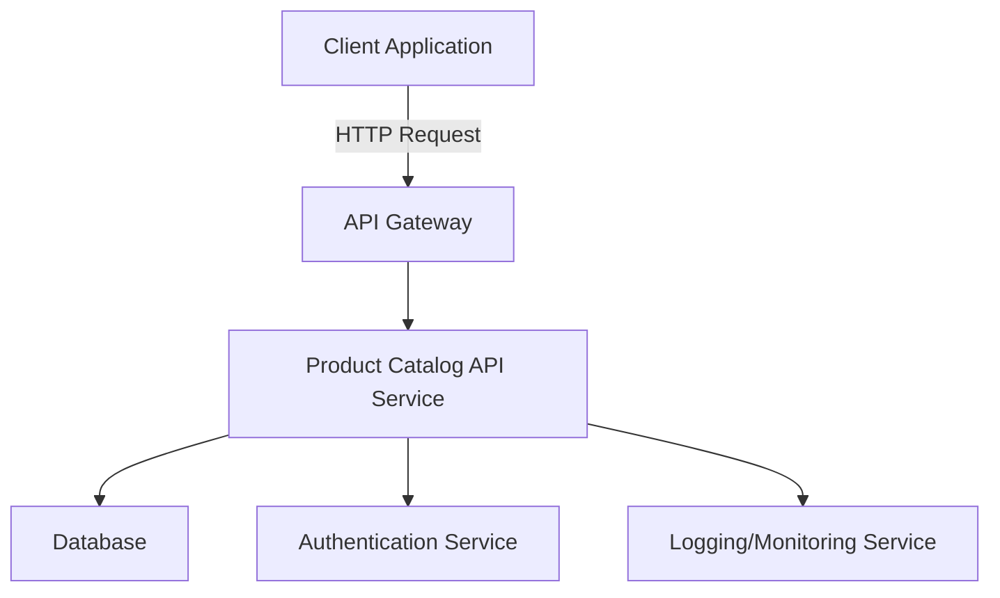

# Product Catalog API Documentation

## 1. Introduction

### Overview  
The **Product Catalog API** is a RESTful interface that allows developers and businesses to manage, access, and interact with a digital catalog of products. It provides endpoints for creating, updating, retrieving, and deleting product information, making it essential for e-commerce platforms, inventory systems, and marketplaces.

### Why It Matters  
A centralized, programmable way to manage product data is critical for scalability, automation, and maintaining data consistency across platforms. The Product Catalog API enables seamless integration between front-end interfaces (e.g., websites, mobile apps) and backend systems (e.g., inventory databases, ERP systems).

### Who This Guide is For  
This documentation is intended for:
- Backend and frontend developers integrating product data
- DevOps engineers managing deployment environments
- Technical product managers overseeing catalog systems
- QA testers validating catalog-related features

---

## 2. Key Terminology

- **API (Application Programming Interface)**: A set of rules that allows different software entities to communicate.
- **SKU (Stock Keeping Unit)**: A unique identifier for each distinct product.
- **CRUD Operations**: Create, Read, Update, Delete – core operations on persistent data.
- **Endpoint**: A specific URL where an API can be accessed.
- **JSON (JavaScript Object Notation)**: A lightweight format for storing and transporting data.
- **HTTP Methods**: Used in APIs to define the action – GET, POST, PUT, DELETE.
- **Pagination**: Dividing large data into smaller, more manageable chunks (pages).
- **Filtering**: Returning only data that meets specified criteria.

---

## 3. Technical Overview

### System Architecture

The Product Catalog API is typically deployed as a microservice within a larger application infrastructure. It connects to a database backend (e.g., PostgreSQL, MongoDB) and serves data to client applications via RESTful endpoints.




Core Frameworks & Tools
* Framework: Node.js with Express or Python Flask/Django REST Framework

* Database: PostgreSQL, MySQL, MongoDB

* Authentication: JWT (JSON Web Tokens) or OAuth 2.0

* Hosting: AWS (EC2, Lambda), Azure, or GCP

* Monitoring: Prometheus, New Relic, ELK Stack

## 4. Step-by-Step Guide or Workflow
### 4.1 Authentication
Most APIs require an API key or token for authentication.

http
```
Authorization: Bearer <your-token>

```
4.2 CRUD Operations
#### 1. Create a Product (POST)
http
Copy
Edit
POST /api/products
Content-Type: application/json
Request Body:

json
```
{
  "name": "Wireless Mouse",
  "sku": "WM123",
  "price": 29.99,
  "category": "Accessories",
  "description": "Ergonomic wireless mouse",
  "in_stock": true
}
Response:
```

json
```
{
  "id": "1a2b3c",
  "message": "Product created successfully"
}
```